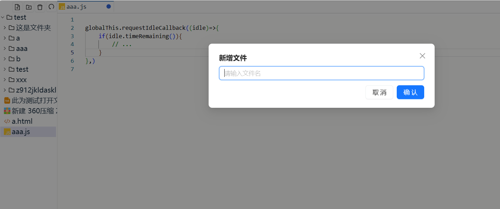
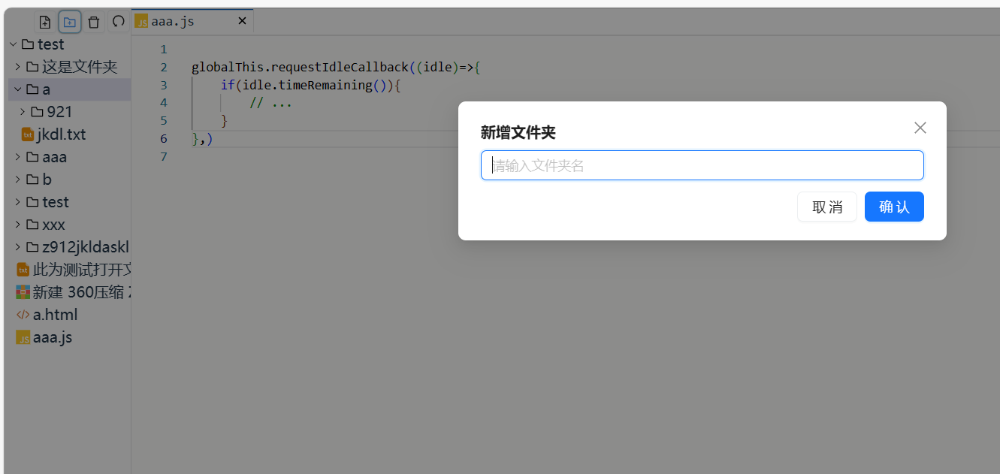
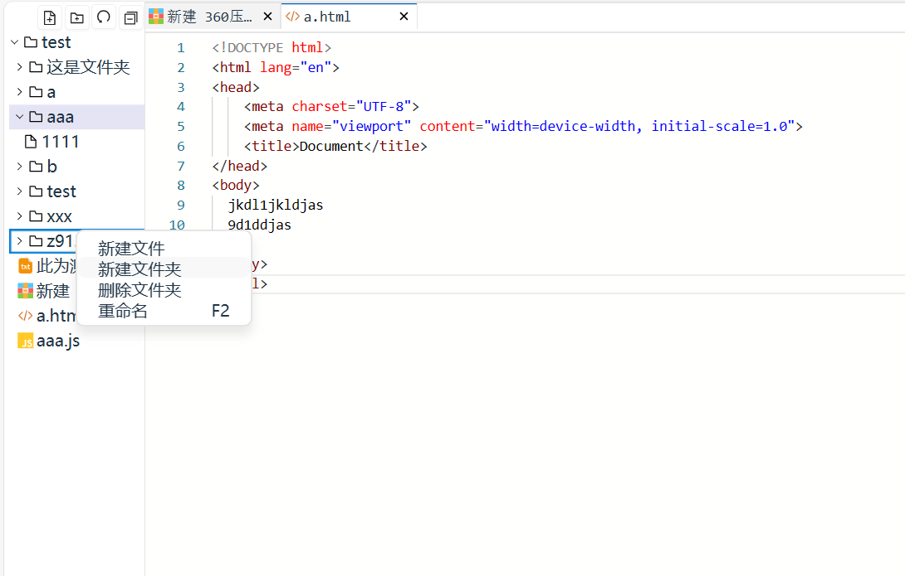

# 网页版文件夹编辑器
# 本人开发其他项目和实习去了，该项目暂且搁置
采用React + Vite + SWC
采用pnpm安装依赖包

目前开发中

    主页
    
    文件打开中
    
    文件打开后
    
    可调节宽度和自适应标签页高度
    
    关闭已修改文件弹出框,支持ctrl+s保存文件
    
    双击顶部隐藏/显示侧栏
    
    简单的设置页面
    
    新建文件
    
    新建文件夹
    
    侧栏右键显示菜单
    

